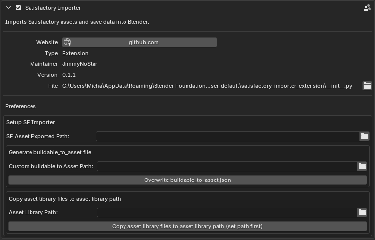

# satisfactory-to-blender
A **blender extension** that imports **save data** and **models** from Coffee Stain Studios' game [Satisfactory](https://www.satisfactorygame.com/). This addon reconstructs your SF save file utilising [satisfactory-3d-map](https://github.com/moritz-h/satisfactory-3d-map) for save parsing and imports the models and materials you extracted using FModel.

## Features
Import save data:
- Rebuild save file in blender
- Rebuild the buildable logic using geometry nodes
- Auto appends models from asset library into file or use models in blend files
- Option to only import buildables with a set boundary 
- Option to import specific buildable types
- Option to generate a proxy mesh in viewport 
- Option to hide buildable after import
- Shows import progress for each buildable
- Show execution time for each buildable type
- Object culling based on their distance from an object (e.g. camera)
- Random object scale to help with clipping

Import models:
- Uses the json build file to look for and import the models used by that buildable.
- Builds and applies materials
- Creates an asset library and the imported models

## Installation
1. Download the latest version of the extension as `.zip` file
2. In Blender, go to Edit > Preferences > Get Extensions.
3. Click Install from disk and select the .zip file.
4. Blender will then install the addon and a new panel called ‘SF Importer’ will appear in the side panel.


## Configuration
### addon preferences tab

1. Open the preferences data, navigate to **Add-ons** and search for **Satisfactory Importer**
2. In the addon preferences tab, add the path to where Fmodel extracted models.
3. Click the **generate buildable_to_asset.json** button to generate it in the addon's files, or to add a custom directory if you want to edit that file to choose what buildables the addon should try and import. You can add other models/buildables as long as you keep the same data structure in the file.
4. Click **Copy asset library file to asset library path** button to get the `SF_Asset_lib.blend` file from the addon files, which will have the geo node groups and materials shader groups needed for the import save logic and material logic.
   
> Note: Do **NOT** use your main asset library, as it will overwrite the `blender_assets.cats.txt`, deleting any categories you’ve made. **Copy the asset library in a different directory** from your main asset library.

## How to use
### FModel
Make sure you export models as
Before you can import models, you need to first extract the following in FModel:
- Build files (e.g. `Build_Blender.json`)
- Models (`.psk` `.pskx`)
- Textures (`.png`)
- Materials (`.json`)

You can export all properties files by right clicking the 'buildable' folder, select **Export Folder** and **Properties (.json)**. this will get both build files and material files.


> FModel settings


---

### Importing and building asset library
To import the extracted models, open the copied blend file and then select **Start Building** in the **side panel**. The addon will import one model at a time and then hide the entire buildable collection to keep Blender from lagging or crashing.

- If you try to import models again and select **Start Building**, it will erase everything in the assets collection.

- Make sure you turn on **Mark as Asset** so that it can create your asset library. You can import models from another blend file, but it will not be able to build materials or create the asset library automatically.
   - After importing all buildables, the addon will attempt to generate previews in the asset browser; however, if there are a large number of buildables, you will need to create previews manually. This is because the buildable collections must be unhidden in order to generate the preview, therefore the addon unhides them and then hides them again after 20 seconds.

> Note: this process can take a while depending on the amount of models it needs to import. Also, I advise reviewing and verifying the models after import because some models and materials might not import properly.

> Note: There are still a few buildables and models that this addon doesn’t import yet, such as items, resources and vehicles. I will try to add them over time.



### Importing SF sav data and rebuilding factories
1. Open the **SF IMPORTER** panel from the side panel and search or paste your `.sav` file in the  **Save File** field. The file has to be `.sav`.
2. Select **Start Scan** in the side panel to start importing you save data into the blend file.

- To make the addon use your **SF asset library**, enable `Use Library Models`. This will append models from the `SF_Asset_Lib` file before importing save data instead of using models in the current blend file. 
   - Blender will hang while it appends a model, but will become responsive once appended. You can open the system console to see if it's still appending models.
   - Appending models from your asset library will cause the save import to take longer, luckily, it only needs to be enabled if there's a buildables missing from your blend file.
- You can enable **proxy mesh** to generate a proxy mesh for each instance
- Enable **Hide buildable** to hide the buildable model after import, so not to lag blenders UI. I recommend enabling this, if you are importing large sections.
-You can set a bounding box to only import within the set area
   - Boundaries are calculated using the X and Y coordinates and a set distance.
   - You can use SF coordinates, but the addon uses blender's coordinates, so both X and Y need to be divided by 100 and the Y axis needs to be flipped. i.e. SF: (X)-500,000(Y)-2000,000 -> blender: (X)-500 (Y)2,000

You can choose to import between 4 buildable types individually or all at once. Signs and spline buildables are usually the most heavy to import, so I recommend importing them separately. Hide/delete splines that will never be visible during render.


---
Buildables are imported as points with attributes attached needed to reconstruct the logic in geometry nodes and model instancing. This allows for extra modification and implementation of your own logic.
- Points can be deleted in ‘edit mode’ or separated into a different model for extra adjustments or modifications.

The addon parses the save file in a separate thread, so it does not freeze blender’s UI. Blender API has to run on the main thread, so the UI will be frozen when creating/modifying objects and collections. This can be very noticeable when working with buildables with large amounts of instances.

Model instancing and buildable logic are done using geometry nodes
- There are extra controls for instance position adjustments and object culling
- Object isn't perfect yet, and will change overtime
- If an instance or spline will never be visible, it would be better to hide that spline or go into exit mode and delete that point.
- To **reimport** the geo node groups, remove the **fake user** tag, so the addon and pull a new copy of the node group. It will not reimport if a node group of the same name exists in the blend file and has a ‘fake user’ tag applied.

Sign text is enabled through the geo nodes modifier, but they are heavy work with. To get sign text, the addon creates text objects and saves them in a collection that the modifier references; however, the resolution of the text mask is determined by the number of faces on the screen, therefore there are two subdivision fields:
- **Base subdivision**, subdivides the entire face.
- **Text mask subdivision**, which only divides the masked area.
Because of this, text has additional culling options to help with optimization.

I recommend importing a section of your save without models, as a preview. The addon uses a default mesh with the primary colour applied, if there are no models.

Some geo node logics aren't implemented very well, so some buildables won’t look exactly like your save.
It is better to hide or delete buildable points/splines than relying on object culling.
Note: Blender doesn't like multi-threading all that much, so this add-on can not be published on the blender extensions website :/

> Note: Blender doesn't like multi-threading all that much, so this add-on can not be published on the blender extensions website :/

> Note: this addon uses the Unreal PSK/PSA (.psk/.psa) addon for importing models. Make sure this is installed before using the addon

## Examples
### Viewport renders


> A section of couq's save imported with Bounding box 


> Example with culling enabled


### Renders


> Couq's sav


---
# buildable_to_asset format JSON Examples
> Use this format when adding your own buildable or model. Id the object has a parent, then make sure the parent object sets before the child object.
```
"Build_Name_C": {
    "ObjectName": "ObjectName",
    "Internal_Object_name": {
      "Mesh": "Path-To-Mesh/",
      "RelativeLocation": null,
      "RelativeRotation": null,
      "RelativeScale3D": null
    },
    "Internal_Object_name2": {
      "Parent": "Parent_ObjectName",
      "ParentAttach": null,
      "Mesh": "Path-To-Mesh/",
      "RelativeLocation": null,
      "RelativeRotation": null,
      "RelativeScale3D": null
    }
  },
```
**Example**
```
"BP_ProductionIndicatorInstanced_C": {
    "ObjectName": "ProductionIndicatorInstanced",
    "Default__BP_ProductionIndicatorInstanced_C": {
      "Mesh": "FactoryGame/Buildable/Factory/-Shared/ProductionIndicator/Mesh/SM_ProductionLight_01",
      "RelativeLocation": null,
      "RelativeRotation": null,
      "RelativeScale3D": null
    }
  },
```

## Links
